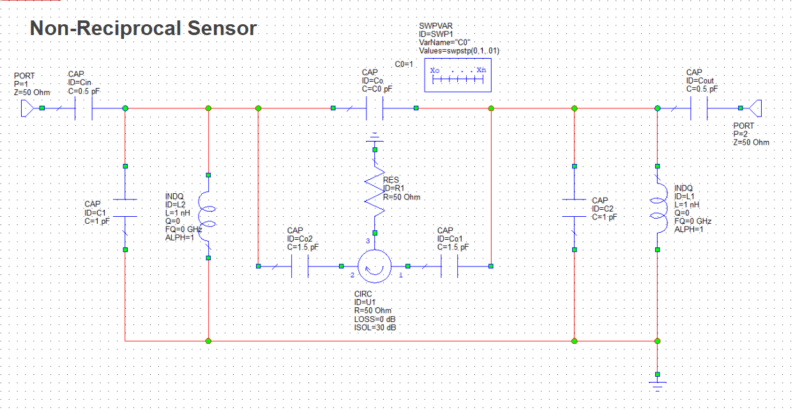
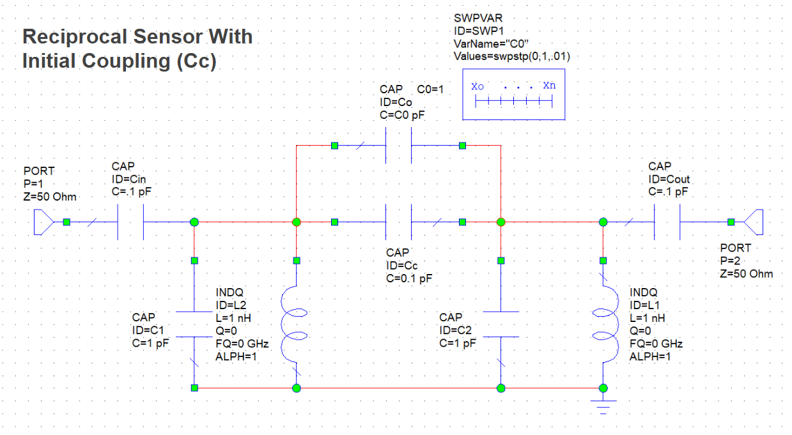
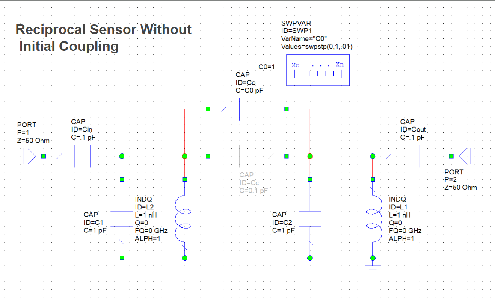

# Non-Reciprocal Sensor Data Analysis

This project processes transmission spectrum data (S21 parameter) from RF sensors to analyze frequency shifts as a function of capacitance (Co).

## Circuit Designs

The three sensor configurations analyzed in this project:

### Non-Reciprocal Sensor


Features a circulator (CIRC) that provides non-reciprocal signal transmission. The circuit includes:
- Two LC resonator tanks (L1/C1 and L2/C2)
- Coupling capacitors (Co1, Co2) connected to the circulator
- Variable capacitor Co for tuning (swept 0-1 pF)
- 50 Ohm input/output ports

### Reciprocal Sensor with Initial Coupling (Cc)


A reciprocal design with initial coupling capacitor Cc between the two resonators:
- Two LC resonator tanks (L1/C1 and L2/C2)
- Coupling capacitor Cc = 0.1 pF provides baseline coupling
- Variable capacitor Co for tuning (swept 0-1 pF)
- 50 Ohm input/output ports

### Reciprocal Sensor without Initial Coupling


Similar to above but without the initial coupling capacitor:
- Two LC resonator tanks (L1/C1 and L2/C2)
- No initial coupling (Cc shown grayed out / disconnected)
- Variable capacitor Co for tuning (swept 0-1 pF)
- At Co=0, the resonators are decoupled (no transmission)

## Overview

The sensors generate transmission spectra (frequency vs. |S21|) at various capacitor values (Co: 0-1 pF). Each spectrum contains characteristic peaks corresponding to the resonant modes. By tracking how the difference between peaks changes with capacitance, we can characterize the sensor's response.

## Data Files

Three sensor datasets in `data/`:

| File | Sensor Type |
|------|-------------|
| `Reciprocal Sensor with IC Co sweep (o-1pf).xlsx` | Reciprocal sensor with initial coupling |
| `non reciprocal sensor (0-1) co sweep.xlsx` | Non-reciprocal sensor |
| `reciprocal sensor without IC (0-1pf_.xlsx` | Reciprocal sensor without initial coupling |

### Data Format

- **Frequency range**: 0.10 - 20.00 GHz (1991 points)
- **Capacitance range**: 0 - 1 pF (101 values, 0.01 pF steps)
- **Transmission**: Linear magnitude of S21 parameter

## Output

The analysis produces:

### Main Results (`output/`)
- **DeltaF vs Co plots** - Individual plots for each sensor
- **Summary comparison plot** - All 3 sensors overlaid

### Fitting Diagnostics (`fitting/`)
- ~20 diagnostic plots per sensor showing raw spectra with detected peaks
- Allows visual verification of peak detection accuracy

## Quick Start

```bash
# Install dependencies
pip install -r requirements.txt

# Run the analysis
python src/process_sensor_data.py
```

## Algorithm

1. **Load Data**: Read Excel files containing frequency vs transmission for each Co value
2. **Peak Detection**:
   - Try standard peak finding with progressively lower thresholds
   - Fall back to second derivative analysis for merged/shoulder peaks
3. **Baseline Calculation**: At Co=0 (or first valid Co), record the frequency difference between peaks
4. **DeltaF Calculation**: For each Co: `DeltaF = deltaF_baseline - deltaF_current`
5. **Visualization**: Generate individual and summary plots

## Dependencies

- Python 3.8+
- pandas, numpy, scipy, matplotlib, openpyxl

See `requirements.txt` for details.

## Project Structure

```
Non-reciprocal-sensor/
├── README.md              # This file
├── TASK.md                # Detailed task instructions
├── requirements.txt       # Python dependencies
├── circuits/              # Circuit diagram images
├── data/                  # Excel data files
├── output/                # Generated plots
├── fitting/               # Peak detection diagnostic plots
└── src/
    └── process_sensor_data.py  # Main processing script
```

## Task Instructions

See [TASK.md](TASK.md) for detailed processing algorithm and implementation guidance.
